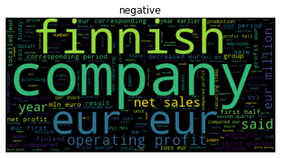
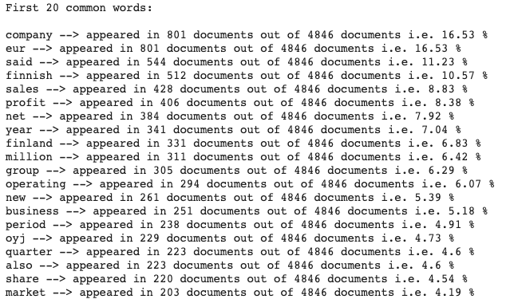
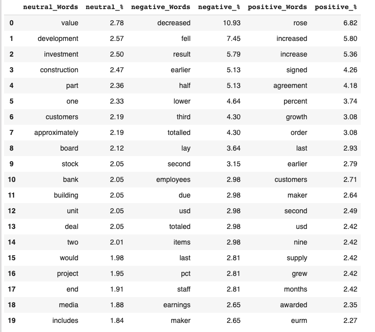

# Sentiment analysis for financial news

Sentiment analysis, also known as opinion mining, refers to the use of natural language processing, text analysis and computational linguistics to identify and extract subjective information in source materials. (Wikipedia) 
In real life, Financial Market Analysts make predictions on the stock market based on opinions and happenings in the news.
A simple example  for the financial sector can be explained by the task of assigning positive, negative or neutral sentiment values to the words. For instance, words such as “good“, “benefit“, “positive“, and “growth” are all tagged with positive scores while words such as “risk“, “fall“, “bankruptcy“, and “loss” are tagged with negative scores.

## Table of contents
* [Motivation](#Motivation)
* [File Descriptions](#File-Descriptions)
* [Results](#Results)
* [Tools](#Tools)
* [Technologies](#technologies)
* [Contact](#Contact)


## Motivation
Create tools for Text Analysis.

As a data scientist for an insurance company, I found myself working on text data.

Text is an unstructured data which can provide a lot of information. And doing a statistical analysis on it allows to draw some information.

The idea is to use Data Analysis for helps us identify words, or combination of word for a better understanding of the market.

* What are the most commun words ?
* Are there significant words ?
* How to use N-grams ?

Identified the most common words allows us to discover useful information, informing conclusions and supporting decision-making.
But sometimes some common words can be considered as stop words. Indeed, if they are present in each label with similar proportions, it is very likely that they do not provide information.


## File Descriptions

In this repository, you will find :
* [One notebook](sentiment_analysis_for_financial_news.ipynb)
* [The Data](all-data.csv)
* [Image Folder](images)

## Results 
The main findings of the code can be found at [the post available]](https://medium.com/@isaaccohensabban/exploratory-data-analysis-for-natural-language-processing-2d5a98dfd12d?sk=116eb6bc304a3732b216bae7507437ca)

## Tools

### Wordcloud
A Wordcloud function is available by using [Wordcloud's package](https://github.com/amueller/word_cloud)
```python
def plot_word_cloud(data,text='text',label=None,save=True):
  """ Inputs : Dataset, text colums,labels column
  Output : Word cloud for all the corpus and for each label"""
  word_cloud_data = " ".join([post for post in data[text] ])
  word_cloud_data = WordCloud(stopwords=STOPWORDS).generate(word_cloud_data)
  plt.figure()
  plt.imshow(word_cloud_data)
  plt.title('All corpus')
  plt.axis("off")
  plt.show()
  if save:
    plt.savefig('wordcloud.png', dpi=300)
  if label !=None:
    labels=data[label].unique()
    for i in range(len(labels)):
          word_cloud_data = " ".join([post for (post,label) in zip(data[text],data[label]) if label==labels[i]])
          word_cloud_data = WordCloud(stopwords=STOPWORDS).generate(word_cloud_data)
          plt.figure(i)
          plt.imshow(word_cloud_data)
          plt.title('{}'.format(labels[i]))
          plt.axis("off")
 ```
          



### Word Frequencies
A Word Frequencies function is available.
It prints the most commun word for each labels and remove the most commun word in some case.
```python
def word_frequencies(data,word):

  c_unique = Counter()
  for ind in data.index:
      c_unique.update(Counter(set(data.loc[ind][word])))

  print('First 20 common words:\n')
  for word in c_unique.most_common(20):
      print(word[0],'-->', 'appeared in',word[1],'documents out of {} documents i.e.'.format(len(data)),np.round(100*word[1]/len(data),2),'%')
```
      




## Technologies
### Languages
Project is created with Python 3.6.9.

### Dependencies


* [NumPy](https://numpy.org)
* [Matplotlib](https://matplotlib.org)
* [pandas](https://pandas.pydata.org)
* [Wordcloud](https://github.com/amueller/word_cloud)
* [NLTK](https://www.nltk.org/)
* [re](https://docs.python.org/3/library/re.html)
* [collections](https://docs.python.org/2/library/collections.html)


## Contact

* Mail: isaaccohensabban_at_gmail_dot_com
